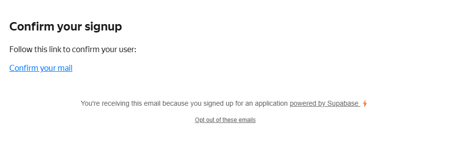
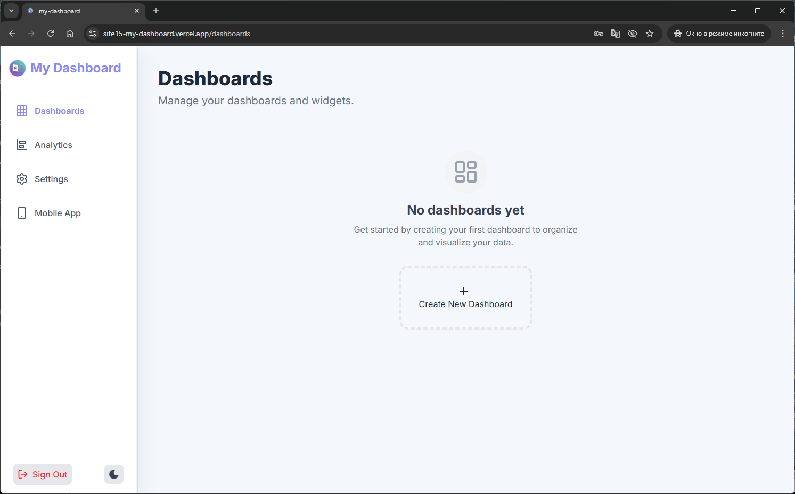
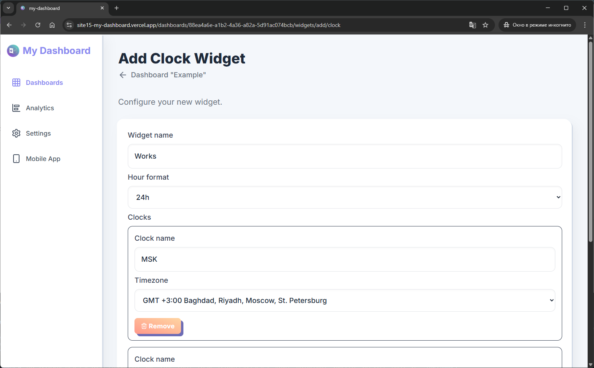
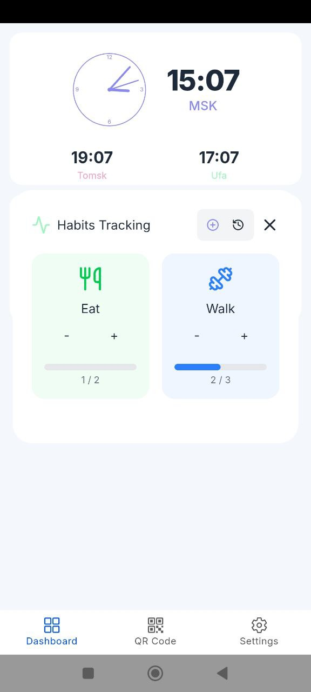
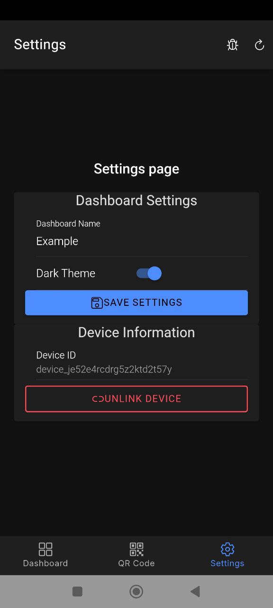

# [2026-01-05] My Dashboard

I built a full-stack web app using Analog and a mobile Android client using the Ionic Framework, and I decided to write a short post about it.

## Idea

I have several old Android devices lying around at home. I decided to turn them into dashboards for displaying information with input capabilities.

## Tech Stack

When developing the project, I initially decided to choose technologies I'd never used before—just to try something new. The final choice was:

- **mobile app** — Flutter (I've heard it produces beautiful and fast apps);
- **web** — Vue (I prefer Angular, but I've been wanting to try Vue in a large project for a while);
- **server** — tRPC (I've heard a lot about it: it's fast and allows you to pass typing in a monorepo to the frontend without generating an SDK).

After spending four days setting up the development environment, CI/CD, and deployment, as well as writing simple hello-world apps, I realized that development would drag on because I'd have to learn too many unfamiliar things.

As a result, I switched stacks to more or less familiar technologies:

- **mobile app** — Ionic (I haven't written anything for it in a while);
- **web** — Analog (uses Angular and SSR rendering);
- **server** — Analog + tRPC (since Analog uses tRPC as a server framework in its examples, I decided to keep it).

Initially, I planned to write the bulk of the code manually and without neural networks, and then incorporate them during the UI design, theming, and layout stages. However, in practice, things turned out differently—about 80% of the code was written using neural networks.

## Technical Specifications

This can hardly be called a full-fledged technical specification, but I couldn't think of another name. Below is a list of requirements for the first version of the project.

1. One dashboard can only be linked to one physical device.
2. A dashboard can contain various widgets for displaying information.
3. Widgets can not only display information but also transmit data from the dashboard device.
4. An admin panel is required to create dashboards and link widgets to them.
5. The admin panel must be able to edit widget options.
6. Dashboards must support a dark theme.
7. Login to the admin panel is possible both for an anonymous user and via Telegram authorization.
8. Examples of widgets with different logic and customization options should be added:
- **clock** — displays three clock faces with three time zones;
- **calendar** — shows how many days have passed since the beginning of the month;
- **habits** — a widget for tracking daily tasks and habits.
9. The website and mobile app should be deployed automatically via CI/CD with notifications sent to the Telegram channel.

## Development Stages

At the beginning of the project, I completed each part separately and in stages: first, I designed the database, then wrote the backend, then the frontend, the mobile app, and then the deployment. Below is a brief overview of each stage.

### Database

I usually write database migrations manually and apply them via my migrator:
[https://www.npmjs.com/package/pg-flyway](https://www.npmjs.com/package/pg-flyway)

But for this project, I decided to try Prisma's schema-first approach: describe and modify the Prisma schema, and then generate migrations via Prisma Migrate:
[https://www.prisma.io/docs/orm/prisma-migrate](https://www.prisma.io/docs/orm/prisma-migrate)

Part of the current schema tables:
[https://github.com/site15/my-dashboard/blob/main/web/prisma/schema.prisma](https://github.com/site15/my-dashboard/blob/main/web/prisma/schema.prisma)

```prisma
model Dashboard {
  id           String    @id(map: "PK_DASHBOARD") @default(uuid()) @db.Uuid
  name         String
  deviceId     String?
  userId       String    @db.Uuid
  isBlackTheme Boolean?
  isActive     Boolean?
  User         User      @relation(fields: [userId], references: [id], onDelete: NoAction, onUpdate: NoAction, map: "FK_DASHBOARD__USER_ID")
  Widget       Widget[]
  createdAt    DateTime  @default(now())
  updatedAt    DateTime  @default(now())
  deletedAt    DateTime?
  qrCodes      QrCode[]  @relation(map: "FK_WIDGET__DASHBOARD_ID")

  @@unique([userId, name], map: "UQ_DASHBOARD__USER_ID_NAME")
  @@unique([deviceId], map: "UQ_DASHBOARD__DEVICE_ID")
  @@index([userId], map: "IDX_DASHBOARD__USER_ID")
}

model Widget {
  id          String @id(map: "PK_WIDGET") @default(uuid()) @db.Uuid
  type        String
  options     Json?
  state       Json?
  columnIndex Int?
  rowIndex    Int?
  columnCount Int?
  rowCount    Int?
  isBlackTheme    Boolean?
  isActive        Boolean?
  backgroundColor String?
  primaryColor    String?
  positiveColor   String?
  negativeColor   String?
  dashboardId String      @db.Uuid
  Dashboard   Dashboard   @relation(fields: [dashboardId], references: [id], onDelete: NoAction, onUpdate: NoAction, map: "FK_WIDGET__DASHBOARD_ID")
  WidgetLog   WidgetLog[]
  createdAt DateTime  @default(now())
  updatedAt DateTime  @default(now())
  deletedAt DateTime?

  @@index([dashboardId], map: "IDX_WIDGET__DASHBOARD_ID")
}
```

### Backend

Initially, I planned to use pure tRPC ([https://trpc.io](https://trpc.io)), but then I started looking for integration with Angular. That's where I came across the Analog framework ([https://analogjs.org](https://analogjs.org)), which already has tight SSR integration with tRPC.

As a result, I started writing the backend in the style that Analog demonstrates in its documentation.

Connection example routers:
[https://github.com/site15/my-dashboard/blob/main/web/src/server/trpc/routers/index.ts](https://github.com/site15/my-dashboard/blob/main/web/src/server/trpc/routers/index.ts)

```ts
export const appRouter = router({
  users: userRouter,
  telegram: telegramRouter,
  auth: authRouter,
  dashboards: dashboardsRouter,
  widgets: widgetsRouter,
  userStorage: userStorageRouter,
  device: deviceRouter,
});

// export type definition of API
export type AppRouter = typeof appRouter;
```

Example controller:
[https://github.com/site15/my-dashboard/blob/main/web/src/server/trpc/routers/widgets.ts](https://github.com/site15/my-dashboard/blob/main/web/src/server/trpc/routers/widgets.ts)

```ts
export const widgetsRouter = router({
  create: publicProcedure
    .input(CreateWidgetSchema)
    .output(WidgetSchema)
    .mutation(async ({ input, ctx }) => {
      if (!ctx.user) {
        throw new TRPCError({
          code: "FORBIDDEN",
          message: "User not found!",
        });
      }
      return (await prisma.widget.create({
        data: {
          type: input.type,
          options: {
            ...input.options,
            type: input.type,
          } as any,
          columnIndex: input.columnIndex,
          rowIndex: input.rowIndex,
          columnCount: input.columnCount,
          rowCount: input.rowCount,
          isBlackTheme: input.isBlackTheme,
          backgroundColor: input.backgroundColor,
          primaryColor: input.primaryColor,
          positiveColor: input.positiveColor,
          negativeColor: input.negativeColor,
          dashboardId: input.dashboardId,
          createdAt: new Date(),
        },
      })) satisfies WidgetType;
    }),
});
```

### Frontend

Analog components are almost identical to Angular components. I didn't go into the details – at first glance, everything is practically the same.

Unlike typical Angular development, in this project I decided to create both Fewer files were possible to make it easier to "feed" the project to neural networks later. As a result, the components became single-file.

Component example:
[https://github.com/site15/my-dashboard/blob/main/web/src/app/pages/dashboards/index.page.ts](https://github.com/site15/my-dashboard/blob/main/web/src/app/pages/dashboards/index.page.ts)

```ts
export const routeMeta: RouteMeta = {
  canActivate: [ShowNavGuard],
};

@Component({
  selector: "dashboards-list-page",
  standalone: true,
  changeDetection: ChangeDetectionStrategy.OnPush,
  imports: [AsyncPipe, LucideAngularModule],
  template: ` <h1 class="text-4xl font-extrabold text-gray-800 mb-2">
      Dashboards
    </h1>
    <p class="text-xl text-gray-500 mb-8">
      Manage your dashboards and widgets.
    </p>

    <div
      class="grid grid-cols-1 sm:grid-cols-2 lg:grid-cols-3 xl:grid-cols-4 2xl:grid-cols-5 gap-8"
    >
      @for ( dashboard of dashboards$ | async; track dashboard.id; let last =
      $last ) {
      <a
        href="/dashboards/{{ dashboard.id }}"
        class="bg-white p-6 rounded-2xl long-shadow transition-all duration-300 hover:scale-[1.02] cursor-pointer"
      >
        <div class="flex justify-between items-start mb-4">
          <i-lucide
            name="layout-dashboard"
            class="w-10 h-10 text-pastel-blue bg-pastel-blue/10 rounded-lg"
          ></i-lucide>
          <span
            class="text-sm font-medium text-gray-500 px-3 py-1 bg-gray-100 rounded-full"
            >{{ dashboard.isActive ? "Active" : "Draft" }}</span
          >
        </div>
        <h2 class="text-2xl font-bold text-gray-800 mb-2">
          {{ dashboard.name }}
        </h2>
        <div
          class="flex justify-between items-center text-sm font-medium text-gray-600 pt-2 border-t border-gray-100"
        >
          <span>Widgets: {{ dashboard.widgetsCount }}</span>
          <span
            class="flex items-center text-pastel-blue hover:text-pastel-blue/80"
          >
            Open
            <i-lucide name="arrow-right" class="w-4 h-4 ml-1"></i-lucide>
          </span>
        </div>
      </a>
      @if (last) {
      <a
        class="border-4 border-dashed border-gray-200 rounded-2xl transition-all duration-300 hover:border-pastel-blue/50 hover:bg-pastel-blue/5 cursor-pointer h-40 flex items-center justify-center"
        href="/dashboards/new"
      >
        <i-lucide name="plus" class="w-6 h-6 mr-2"></i-lucide>
        Create New Dashboard
      </a>
      } } @empty {
      <div class="col-span-full text-center py-12 flex flex-col items-center">
        <div class="inline-block p-4 bg-gray-100 rounded-full mb-4">
          <i-lucide
            name="layout-dashboard"
            class="w-12 h-12 text-gray-400"
          ></i-lucide>
        </div>

        <h3 class="text-2xl font-bold text-gray-700 mb-2">No dashboards yet</h3>
        <p class="text-gray-500 max-w-md mx-auto mb-8">
          Get started by creating your first dashboard to organize and visualize
          your data.
        </p>

        <a
          class="border-4 border-dashed border-gray-200 rounded-2xl transition-all duration-300 hover:border-pastel-blue/50 hover:bg-pastel-blue/5 cursor-pointer p-8 flex flex-col items-center justify-center"
          href="/dashboards/new"
        >
          <i-lucide name="plus" class="w-6 h-6 mr-2"></i-lucide>
          Create New Dashboard
        </a>
      </div>
      }
    </div>`,
})
export default class DashboardsListPageComponent {
  private readonly dashboardsService = inject(DashboardsService);

  readonly dashboards$ = this.dashboardsService.list();
}
```

Service example:
[https://github.com/site15/my-dashboard/blob/main/web/src/app/services/dashboards.service.ts](https://github.com/site15/my-dashboard/blob/main/web/src/app/services/dashboards.service.ts)

```ts
@Injectable({
  providedIn: "root",
})
export class DashboardsService {
  private trpc = injectTrpcClient();

  create(dashboard: CreateDashboardType) {
    return this.trpc.dashboards.create.mutate(
      Object.fromEntries(
        Object.entries(dashboard).filter(([, value]) => value !== "")
      ) as CreateDashboardType
    );
  }

  read(id: string) {
    return this.trpc.dashboards.read.query({ id });
  }

  update(dashboard: UpdateDashboardType) {
    return this.trpc.dashboards.update.mutate(
      Object.fromEntries(
        Object.entries(dashboard).filter(([, value]) => value !== "")
      ) as UpdateDashboardType
    );
  }

  delete(id: string) {
    return this.trpc.dashboards.delete.mutate({ id });
  }

  list() {
    return this.trpc.dashboards.list.query();
  }

  generateQrCode(dashboardId: string) {
    return this.trpc.dashboards.generateQrCode.query({ dashboardId });
  }
}
```

### Mobile App

I've previously written mobile apps using the Ionic Framework, but back then they ran on Cordova / PhoneGap. This time, the app runs on Capacitor.

Currently, development is only for Android, as Android devices are often idle. It's also easier to install apps directly on Android without publishing them to stores.

### Deployment

Recently, I've been deploying all my work and personal projects to Kubernetes, but for this project, I decided to try a different approach.

For deployment For the web application, I chose Vercel (https://vercel.com), which allows you to launch small Node.js applications quickly.

Vercel integrates with Supabase (https://supabase.com), where you can create databases and use the built-in authorization system.

Vercel automatically fetches the project from GitHub and deploys it with every code change—I took advantage of this feature.

The mobile application is built using CI/CD inside a Docker container, and the resulting APK file is attached to the release as an artifact.

All scripts for releases, deployment, and sending notifications to Telegram are written using Neural networks:
[https://github.com/site15/my-dashboard/blob/main/.github/workflows/release.yml](https://github.com/site15/my-dashboard/blob/main/.github/workflows/release.yml)

## Authorization

The site supports login via email and password, Telegram, Google, and GitHub, as well as anonymous login.

An anonymous user is a client-side generated 'anonymousId', which is stored in localStorage and used for login.

Authorization via Telegram is implemented using the standard method according to the instructions:
[https://edisonchee.com/writing/telegram-login-with-node.js](https://edisonchee.com/writing/telegram-login-with-node.js)

Login via email, Google, and GitHub is implemented through Vercel integration with Supabase Auth:
[https://supabase.com/docs/guides/auth](https://supabase.com/docs/guides/auth)

## User Guide

### Website

The project is deployed on free hosting and is accessible at the domain:
[https://site15-my-dashboard.vercel.app/](https://site15-my-dashboard.vercel.app/)

#### Website Registration

When you first log in to the website, you'll be taken to the registration/authorization page.

Click the "Sign Up" link, which will display the fields you need to fill out during registration and a green "Sign Up" button.

Fill in the "Email" and "Password" fields, then click "Sign Up."


Registration Page

#### Email Confirmation

After successful registration After registering, an email with a confirmation link will be sent to the email address you provided.



Email with email confirmation link

Click the link in the email, and you'll be redirected to the website, where you'll be automatically logged in and your profile will be displayed.Search for our dashboards.



Dashboard Page

#### Login to the Site

If you've already registered, you'll need to enter your "Email" and "Password," then click "Sign In."


Login Page

After successful login, you'll be redirected to a page with a list of dashboards.


Dashboard Page

#### Creating a Dashboard

To create a new dashboard, click "Create New Dashboard," which will open a page with the dashboard's parameters.


Dashboard creation page

Enter a name and click "Create Dashboard", which will open the editing page for the created dashboard.


Dashboard editing page

#### Adding a clock widget

On the dashboard editing page, there are tabs at the bottom called "Widgets Grid" and "Widgets Preview". Click "Widgets Grid" to display the widget addition panel.


Widget panel

If widgets haven't been added yet, the addition panel with buttons will appear in the middle.

Click the small "clock" button, and you'll be redirected to the widget setup and addition page.

Enter a name for the clock widget and select the 24-hour clock format.


Clock widget add page

Click the "Add clock" button and add all the time zones we need.



Panel with new time zone clocks for the clock widget

After adding all the necessary time zone clocks, click the "Create Widget" button.


Button for adding widget to dashboard

After adding the widget, you are redirected to the dashboard editing page, where the newly added widget is visible.


Dashboard editing page with hourly widget

#### Adding a habit widget

The process for adding widgets is the same; different widgets may just have different options when creating them.


Habit widget adding page

After adding all the widgets, we can see them on the dashboard editing page.


Dashboard editing page with widget list

#### Widget Preview

To preview widgets as they will appear on a mobile device, activate the "Widgets Preview" tab on the dashboard editing page.


Widget Preview Panel

Widgets not only display information, but can also be interacted with.

Tapping the clock widget's dial opens a modal window for selecting the active time zone.


Clock widget modal window

The Habits widget also has a modal window where you can add or subtract from a habit counter.


Habits widget modal window

Each change to the habit counter is saved in the history, which can be viewed in this modal window.


Habit counter increase history

#### Displaying a QR code for linking a mobile device

On the dashboard editing page, there is a "Link Device" button. To link a mobile device, click it.


Dashboard editing page with the link device button

Clicking this button will open a page with a QR code.

[Page with QR code for linking a device to the dashboard](images/image27.png)

Page with QR code for linking a device to the dashboard

### Mobile App

The current mobile app is not published in Android stores; you must download the APK file from the website.

#### Downloading and Installing the Mobile App

On the website, on the login page and in the navigation menu, there is a link to download the latest version of the Android app.


Download link "Download Mobile App" among the links below


Download link "Mobile App" in the left navigation panel

Since the APK file is not from official app stores, not all Android security systems allow its installation.


Application icon after installation

Launch the app—it is not yet linked to the dashboard, so the widgets are not yet displayed.


Empty pageWidget Page

#### Linking a Mobile Device to the Dashboard

Click the "QR Code" tab at the bottom and you'll be taken to the QR code scanning page, where you click the "SCAN QR" button.

Point the camera at the QR code you received on the website and link your phone to the dashboard.


Scan QR Code

After successful linking, you'll be redirected to the "Dashboard" page, where your widgets are displayed.


Widget Page

#### Changing the Main Clock in the Clock Widget

Clicking the clock face will open a modal window for setting the main clock, similar to the web version of the clock widget preview.


Clock modal

#### Completed check mark in the habit widget

The habit modal allows you to increase or decrease the habit counter.



Habit modal

#### Switching to dark theme

Dashboards support dark theme. You can enable it both on the website through the dashboard settings and in the mobile app on the settings page (the "Settings" button).


Settings page

After switching to dark mode ("Dark Theme"), tap "Save settings" and the app theme will change to dark.



Dark Settings Page

The widget page has also switched to dark mode, and the widgets themselves, along with modal windows, are displayed in dark mode.


Dark Widget Page

#### Display in Landscape Mode

If you rotate the phone horizontally, the bottom tab bar with app page switches is hidden, as are the native Android top and bottom bars.


Horizontal dark panel with widgets


Real photo of device with dashboard

#### Unlinking a mobile device

When a device is linked to a dashboard, the previously linked device loses connection with that dashboard.

You can also unlink a device directly from the mobile app: on the settings page, click the "Unlink device" button.


Settings page with a button to unlink a device from a dashboard

---

## Automation

In this project, I decided to abandon ready-made monorepositories (nx, turborepo) and their ecosystem.

For CI/CD convenience, numerous automations generated using a neural network have been added.

The repository contains several projects: a Docker image for building the mobile app, the mobile app itself, and a website. There are both general CI/CD tasks and specific ones for each project.

### Releases

Builds and releases are performed independently for each project and are triggered when there are changes in the code.

### TODO Tasks

A separate task has been created that collects TODO comments from the website and mobile app code and automatically creates issues in GitHub.

### Notifications

Successful and unsuccessful deployment notifications have been added to the Telegram chat.

---

## Roadmap

This is not a full-fledged roadmap for a large product, but a list of goals I wanted to achieve within the project.

Done:

1. Create a minimal MVP with a few widgets.
2. Create interface stubs for future business tasks.
3. Write an article about the work done on Habr.
4. Record any bugs found while writing the article.

To do:

5. Describe the stubs as tasks and gradually implement them.
6. Conduct a complete refactoring of the frontend and backend, as most of the code is written using a neural network.

---

## Links

Current online version:
[https://site15-my-dashboard.vercel.app](https://site15-my-dashboard.vercel.app)

Project repository:
[https://github.com/site15/my-dashboard](https://github.com/site15/my-dashboard)

Telegram chat:
[https://t.me/site15_community/187](https://t.me/site15_community/187)

#angular #trpc #analog #ionicframework