# [2026-01-05] Мой дашборд

Я сделал фулстек-веб-приложение на Analog и мобильный Android-клиент на Ionic Framework и решил написать об этом небольшой пост.

## Идея

У меня дома есть несколько старых Android-устройств, которые просто лежат без дела. Я решил превратить их в дашборды для отображения информации с возможностью ввода данных.

## Технологический стек

При разработке проекта сначала я решил выбрать технологии, на которых раньше вообще не писал — просто чтобы попробовать что-то новое. В итоге выбор был таким:

- **мобильное приложение** — Flutter (я слышал, что на нём получаются красивые и быстрые приложения);
- **веб** — Vue (я предпочитаю Angular, но давно хотел попробовать Vue в каком-нибудь крупном проекте);
- **сервер** — tRPC (много слышал о нём: он быстрый и позволяет прокидывать типизацию в монорепозитории на фронтенд без генерации SDK).

Потратив 4 дня на настройку окружения разработки, CI/CD и деплоя, а также написав простые hello-world-приложения, я понял, что разработка затянется, так как придётся изучать слишком много незнакомых вещей.

В итоге я сменил стек на более или менее знакомые технологии:

- **мобильное приложение** — Ionic (давно под него ничего не писал);
- **веб** — Analog (использует Angular и SSR-рендеринг);
- **сервер** — Analog + tRPC (так как Analog в своих примерах использует tRPC в качестве серверного фреймворка, я решил оставить его).

Изначально я планировал писать основную часть кода вручную и без использования нейросетей, а подключить их уже на этапе UI-дизайна, темизации и вёрстки. Однако на практике вышло иначе — около 80% кода было написано с помощью нейросетей.

## Техническое задание

Это сложно назвать полноценным ТЗ, но другого названия я не придумал. Ниже — список требований к первой версии проекта.

1. Один дашборд может быть привязан только к одному физическому устройству.
2. Дашборд может содержать различные виджеты для отображения информации.
3. Виджеты могут не только отображать информацию, но и передавать данные с устройства дашборда.
4. Нужна админка для создания дашбордов и привязки к ним виджетов.
5. В админке должна быть возможность редактировать опции виджетов.
6. Дашборды должны поддерживать тёмную тему.
7. Вход в админку возможен как для анонимного пользователя, так и через авторизацию Telegram.
8. Нужно добавить примеры виджетов с различной логикой и кастомизацией:
   - **часы** — отображают три циферблата с тремя часовыми поясами;
   - **календарь** — показывает, сколько дней прошло с начала месяца;
   - **привычки** — виджет для учёта выполнения дел и привычек в течение дня.
9. Деплой сайта и мобильного приложения должен выполняться автоматически через CI/CD с уведомлением в Telegram-канал.

## Этапы разработки

В начале проекта я делал каждую часть отдельно и поэтапно: сначала спроектировал базу данных, затем написал бэкенд, потом фронтенд, мобильное приложение и деплой. Ниже — кратко о каждом этапе.

### База данных

Обычно я пишу миграции базы данных вручную и применяю их через свой мигратор:
[https://www.npmjs.com/package/pg-flyway](https://www.npmjs.com/package/pg-flyway)

Но в этом проекте я решил попробовать schema-first-подход Prisma: описывать и изменять схему Prisma, а затем генерировать миграции через Prisma Migrate:
[https://www.prisma.io/docs/orm/prisma-migrate](https://www.prisma.io/docs/orm/prisma-migrate)

Часть текущей схемы таблиц:
[https://github.com/site15/my-dashboard/blob/main/web/prisma/schema.prisma](https://github.com/site15/my-dashboard/blob/main/web/prisma/schema.prisma)

```prisma
model Dashboard {
  id           String    @id(map: "PK_DASHBOARD") @default(uuid()) @db.Uuid
  name         String
  deviceId     String?
  userId       String    @db.Uuid
  isBlackTheme Boolean?
  isActive     Boolean?
  User         User      @relation(fields: [userId], references: [id], onDelete: NoAction, onUpdate: NoAction, map: "FK_DASHBOARD__USER_ID")
  Widget       Widget[]
  createdAt    DateTime  @default(now())
  updatedAt    DateTime  @default(now())
  deletedAt    DateTime?
  qrCodes      QrCode[]  @relation(map: "FK_WIDGET__DASHBOARD_ID")

  @@unique([userId, name], map: "UQ_DASHBOARD__USER_ID_NAME")
  @@unique([deviceId], map: "UQ_DASHBOARD__DEVICE_ID")
  @@index([userId], map: "IDX_DASHBOARD__USER_ID")
}

model Widget {
  id          String @id(map: "PK_WIDGET") @default(uuid()) @db.Uuid
  type        String
  options     Json?
  state       Json?
  columnIndex Int?
  rowIndex    Int?
  columnCount Int?
  rowCount    Int?
  isBlackTheme    Boolean?
  isActive        Boolean?
  backgroundColor String?
  primaryColor    String?
  positiveColor   String?
  negativeColor   String?
  dashboardId String      @db.Uuid
  Dashboard   Dashboard   @relation(fields: [dashboardId], references: [id], onDelete: NoAction, onUpdate: NoAction, map: "FK_WIDGET__DASHBOARD_ID")
  WidgetLog   WidgetLog[]
  createdAt DateTime  @default(now())
  updatedAt DateTime  @default(now())
  deletedAt DateTime?

  @@index([dashboardId], map: "IDX_WIDGET__DASHBOARD_ID")
}
```

### Бэкенд

Изначально я планировал использовать чистый tRPC ([https://trpc.io](https://trpc.io)), но затем начал искать интеграцию с Angular. Так я наткнулся на фреймворк Analog ([https://analogjs.org](https://analogjs.org)), в котором уже есть тесная интеграция SSR-режима с tRPC.

В итоге я начал писать бэкенд в стиле, который Analog демонстрирует в своей документации.

Пример подключения роутеров:
[https://github.com/site15/my-dashboard/blob/main/web/src/server/trpc/routers/index.ts](https://github.com/site15/my-dashboard/blob/main/web/src/server/trpc/routers/index.ts)

```ts
export const appRouter = router({
  users: userRouter,
  telegram: telegramRouter,
  auth: authRouter,
  dashboards: dashboardsRouter,
  widgets: widgetsRouter,
  userStorage: userStorageRouter,
  device: deviceRouter,
});

// export type definition of API
export type AppRouter = typeof appRouter;
```

Пример контроллера:
[https://github.com/site15/my-dashboard/blob/main/web/src/server/trpc/routers/widgets.ts](https://github.com/site15/my-dashboard/blob/main/web/src/server/trpc/routers/widgets.ts)

```ts
export const widgetsRouter = router({
  create: publicProcedure
    .input(CreateWidgetSchema)
    .output(WidgetSchema)
    .mutation(async ({ input, ctx }) => {
      if (!ctx.user) {
        throw new TRPCError({
          code: "FORBIDDEN",
          message: "User not found!",
        });
      }
      return (await prisma.widget.create({
        data: {
          type: input.type,
          options: {
            ...input.options,
            type: input.type,
          } as any,
          columnIndex: input.columnIndex,
          rowIndex: input.rowIndex,
          columnCount: input.columnCount,
          rowCount: input.rowCount,
          isBlackTheme: input.isBlackTheme,
          backgroundColor: input.backgroundColor,
          primaryColor: input.primaryColor,
          positiveColor: input.positiveColor,
          negativeColor: input.negativeColor,
          dashboardId: input.dashboardId,
          createdAt: new Date(),
        },
      })) satisfies WidgetType;
    }),
});
```

### Фронтенд

Компоненты Analog почти ничем не отличаются от Angular-компонентов. В нюансы я не углублялся — на первый взгляд всё практически то же самое.

В отличие от обычной Angular-разработки, в этом проекте я решил создавать как можно меньше файлов, чтобы в дальнейшем было проще «скармливать» проект нейросетям. В итоге компоненты стали однофайловыми.

Пример компонента:
[https://github.com/site15/my-dashboard/blob/main/web/src/app/pages/dashboards/index.page.ts](https://github.com/site15/my-dashboard/blob/main/web/src/app/pages/dashboards/index.page.ts)

```ts
export const routeMeta: RouteMeta = {
  canActivate: [ShowNavGuard],
};

@Component({
  selector: "dashboards-list-page",
  standalone: true,
  changeDetection: ChangeDetectionStrategy.OnPush,
  imports: [AsyncPipe, LucideAngularModule],
  template: ` <h1 class="text-4xl font-extrabold text-gray-800 mb-2">
      Dashboards
    </h1>
    <p class="text-xl text-gray-500 mb-8">
      Manage your dashboards and widgets.
    </p>

    <div
      class="grid grid-cols-1 sm:grid-cols-2 lg:grid-cols-3 xl:grid-cols-4 2xl:grid-cols-5 gap-8"
    >
      @for ( dashboard of dashboards$ | async; track dashboard.id; let last =
      $last ) {
      <a
        href="/dashboards/{{ dashboard.id }}"
        class="bg-white p-6 rounded-2xl long-shadow transition-all duration-300 hover:scale-[1.02] cursor-pointer"
      >
        <div class="flex justify-between items-start mb-4">
          <i-lucide
            name="layout-dashboard"
            class="w-10 h-10 text-pastel-blue bg-pastel-blue/10 rounded-lg"
          ></i-lucide>
          <span
            class="text-sm font-medium text-gray-500 px-3 py-1 bg-gray-100 rounded-full"
            >{{ dashboard.isActive ? "Active" : "Draft" }}</span
          >
        </div>
        <h2 class="text-2xl font-bold text-gray-800 mb-2">
          {{ dashboard.name }}
        </h2>
        <div
          class="flex justify-between items-center text-sm font-medium text-gray-600 pt-2 border-t border-gray-100"
        >
          <span>Widgets: {{ dashboard.widgetsCount }}</span>
          <span
            class="flex items-center text-pastel-blue hover:text-pastel-blue/80"
          >
            Open
            <i-lucide name="arrow-right" class="w-4 h-4 ml-1"></i-lucide>
          </span>
        </div>
      </a>
      @if (last) {
      <a
        class="border-4 border-dashed border-gray-200 rounded-2xl transition-all duration-300 hover:border-pastel-blue/50 hover:bg-pastel-blue/5 cursor-pointer h-40 flex items-center justify-center"
        href="/dashboards/new"
      >
        <i-lucide name="plus" class="w-6 h-6 mr-2"></i-lucide>
        Create New Dashboard
      </a>
      } } @empty {
      <div class="col-span-full text-center py-12 flex flex-col items-center">
        <div class="inline-block p-4 bg-gray-100 rounded-full mb-4">
          <i-lucide
            name="layout-dashboard"
            class="w-12 h-12 text-gray-400"
          ></i-lucide>
        </div>

        <h3 class="text-2xl font-bold text-gray-700 mb-2">No dashboards yet</h3>
        <p class="text-gray-500 max-w-md mx-auto mb-8">
          Get started by creating your first dashboard to organize and visualize
          your data.
        </p>

        <a
          class="border-4 border-dashed border-gray-200 rounded-2xl transition-all duration-300 hover:border-pastel-blue/50 hover:bg-pastel-blue/5 cursor-pointer p-8 flex flex-col items-center justify-center"
          href="/dashboards/new"
        >
          <i-lucide name="plus" class="w-6 h-6 mr-2"></i-lucide>
          Create New Dashboard
        </a>
      </div>
      }
    </div>`,
})
export default class DashboardsListPageComponent {
  private readonly dashboardsService = inject(DashboardsService);

  readonly dashboards$ = this.dashboardsService.list();
}
```

Пример сервиса:
[https://github.com/site15/my-dashboard/blob/main/web/src/app/services/dashboards.service.ts](https://github.com/site15/my-dashboard/blob/main/web/src/app/services/dashboards.service.ts)

```ts
@Injectable({
  providedIn: "root",
})
export class DashboardsService {
  private trpc = injectTrpcClient();

  create(dashboard: CreateDashboardType) {
    return this.trpc.dashboards.create.mutate(
      Object.fromEntries(
        Object.entries(dashboard).filter(([, value]) => value !== "")
      ) as CreateDashboardType
    );
  }

  read(id: string) {
    return this.trpc.dashboards.read.query({ id });
  }

  update(dashboard: UpdateDashboardType) {
    return this.trpc.dashboards.update.mutate(
      Object.fromEntries(
        Object.entries(dashboard).filter(([, value]) => value !== "")
      ) as UpdateDashboardType
    );
  }

  delete(id: string) {
    return this.trpc.dashboards.delete.mutate({ id });
  }

  list() {
    return this.trpc.dashboards.list.query();
  }

  generateQrCode(dashboardId: string) {
    return this.trpc.dashboards.generateQrCode.query({ dashboardId });
  }
}
```

### Мобильное приложение

Ранее я уже писал мобильные приложения на Ionic Framework, но тогда оно работало на Cordova / PhoneGap. В этот раз приложение работает на Capacitor.

На данный момент разработка ведётся только под Android, так как именно Android-устройства лежат без дела. Кроме того, под Android проще устанавливать приложения напрямую, не публикуя их в сторах.

### Деплой

В последнее время все рабочие и домашние проекты я деплоил в Kubernetes, но в этом проекте решил попробовать другой подход.

Для деплоя веб-приложения я выбрал Vercel ([https://vercel.com](https://vercel.com)), который позволяет запускать небольшие Node.js-приложения с быстрым стартом.

Vercel имеет интеграцию с Supabase ([https://supabase.com](https://supabase.com)), где можно создавать базы данных и использовать встроенную систему авторизации.

Vercel автоматически забирает проект из GitHub и деплоит его при каждом изменении кода — этой возможностью я и воспользовался.

Мобильное приложение собирается в CI/CD внутри Docker-контейнера, а полученный APK-файл прикрепляется к релизу в виде артефакта.

Все скрипты для релизов, деплоя и отправки уведомлений в Telegram написаны с помощью нейросети:
[https://github.com/site15/my-dashboard/blob/main/.github/workflows/release.yml](https://github.com/site15/my-dashboard/blob/main/.github/workflows/release.yml)

## Авторизация

На сайте доступен вход по email и паролю, через Telegram, Google и GitHub, а также в режиме анонимного пользователя.

Анонимный пользователь — это сгенерированный на стороне клиента `anonymousId`, который сохраняется в localStorage и используется при входе.

Авторизация через Telegram реализована стандартным способом по инструкции:
[https://edisonchee.com/writing/telegram-login-with-node.js](https://edisonchee.com/writing/telegram-login-with-node.js)

Вход по email, Google и GitHub реализован через интеграцию Vercel с Supabase Auth:
[https://supabase.com/docs/guides/auth](https://supabase.com/docs/guides/auth)

## Руководство пользователя

### Сайт

Проект деплоится на бесплатный хостинг и доступен по домену:
[https://site15-my-dashboard.vercel.app/](https://site15-my-dashboard.vercel.app/)

#### Регистрация на сайте

При первом входе на сайт мы попадаем на страницу регистрации/авторизации.

Нужно нажать на ссылку “Sign Up”, после чего появятся поля, которые необходимо заполнить при регистрации, и зеленая кнопка “Sign Up”.

Заполняем поля “Email” и “Password”, затем нажимаем “Sign Up”.


Страница регистрации

#### Подтверждение e-mail

После успешной регистрации на указанный e-mail придёт письмо с ссылкой на подтверждение.


Письмо с ссылкой на подтверждение e-mail

Необходимо нажать на ссылку из письма, и мы попадём на сайт, где произойдёт автоматический вход и отображение списка наших дашбордов.


Страница с дашбордами

#### Авторизация на сайте

Если мы уже ранее регистрировались, нужно ввести свои “Email” и “Password”, затем нажать “Sign In”.


Страница авторизации

После успешной авторизации нас перенаправит на страницу со списком дашбордов.


Страница с дашбордами

#### Создание дашборда

Для создания нового дашборда нужно нажать на “Create New Dashboard”, после чего откроется страница с параметрами дашборда.


Страница создания дашборда

Вводим название и нажимаем “Create Dashboard”, после чего открывается страница редактирования созданного дашборда.

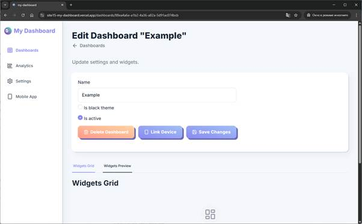

Страница редактирования дашборда

#### Добавление виджета с часами

На странице редактирования дашборда внизу есть вкладки “Widgets Grid” и “Widgets Preview”. Нажимаем “Widgets Grid” для отображения панели добавления виджетов.


Панель виджетов

Если виджеты ещё не добавлялись, панель добавления с кнопками отображается посередине.

Нажимаем маленькую кнопку “clock” — и нас перенаправляет на страницу настройки и добавления виджета.

Указываем название виджета часов и выбираем формат часов 24h.

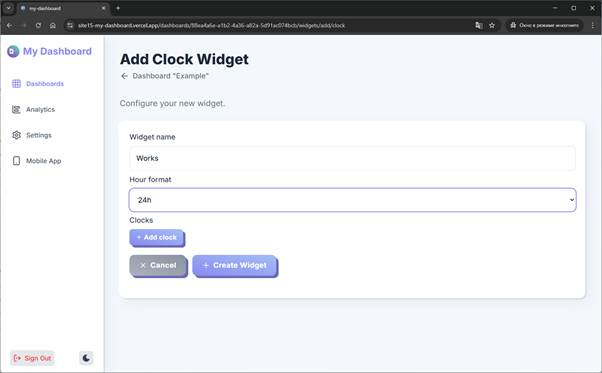

Страница добавления виджета часов

Нажимаем кнопку “Add clock” и добавляем все временные зоны, которые нам нужны.

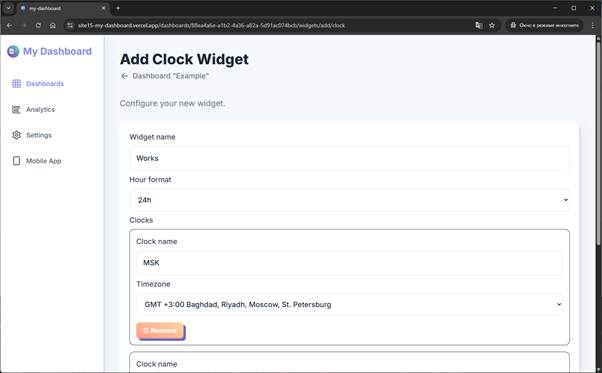

Панель с новыми таймзон-часами для виджета часов

После добавления всех необходимых таймзон-часов нажимаем кнопку “Create Widget”.

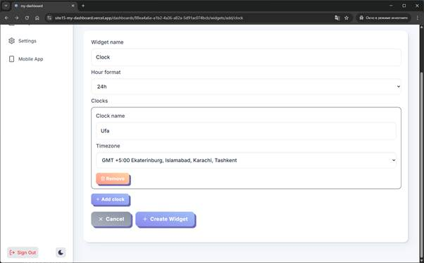

Кнопка добавления виджета в дашборд

После добавления виджета нас перенаправляет на страницу редактирования дашборда, где виден только что добавленный виджет.


Страница редактирования дашборда с виджетом по часам

#### Добавление виджета с привычками

Процесс добавления виджетов одинаковый, просто разные виджеты могут иметь разные опции при создании.


Страница добавления виджета с привычками

После добавления всех виджетов мы можем видеть их на странице редактирования дашборда.


Страница редактирования дашборда с списком виджетов

#### Предпросмотр виджетов

Для просмотра виджетов в том виде, в каком они будут отображаться на мобильном устройстве, на странице редактирования дашборда нужно активировать вкладку “Widgets Preview”.


Панель предпросмотра виджетов

Виджеты не только показывают информацию, с ними можно взаимодействовать.

Если нажать на циферблат виджета часов, появляется модальное окно для выбора активного таймзона.


Модальное окно виджета часов

Виджет привычек также имеет модальное окно, в котором можно добавлять или уменьшать счетчик привычки.

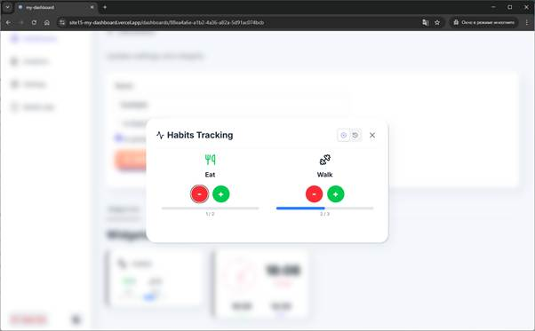

Модальное окно виджета привычек

Каждое изменение счетчика привычки сохраняется в историю, которую можно посмотреть в этом же модальном окне.

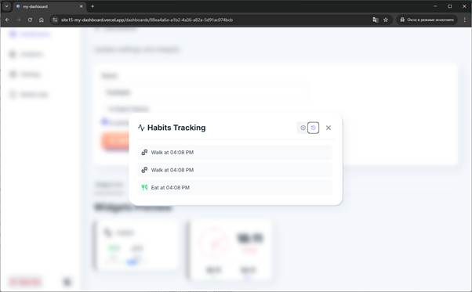

История увеличения счетчика привычек

#### Отображение QR-кода для привязки мобильного устройства

На странице редактирования дашборда есть кнопка “Link Device”. Для привязки мобильного устройства нужно нажать её.

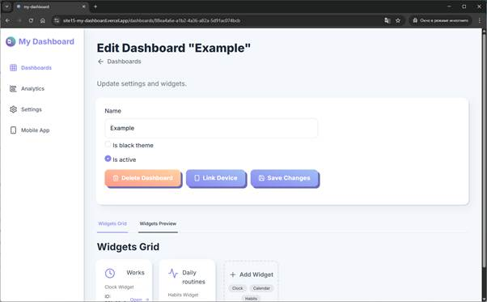

Страница редактирования дашборда с кнопкой привязки устройства

После нажатия откроется страница с QR-кодом.

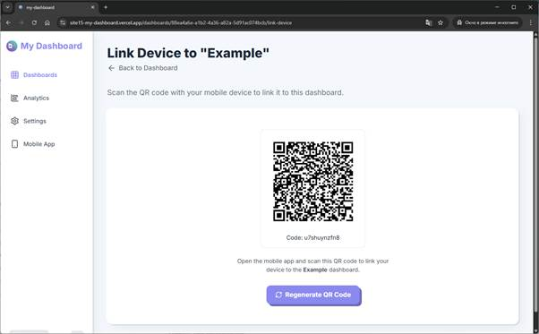

Страница с QR-кодом для привязки устройства к дашборду

### Мобильное приложение

Текущее мобильное приложение не публиковалось в Android-сторах, скачивать APK-файл нужно с сайта.

#### Скачивание и установка мобильного приложения

На сайте, на странице авторизации и в меню навигации, есть ссылка на скачивание последней версии Android-приложения.


Ссылка на скачивание “Download Mobile App” среди ссылок внизу


Ссылка на скачивание “Mobile App” в левой навигационной панели

Так как APK-файл не из официальных магазинов приложений, не все системы безопасности Android разрешают его установку.

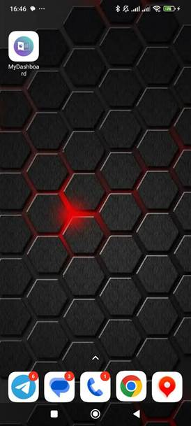

Иконка приложения после установки

Запускаем приложение — оно ещё не привязано к дашборду, поэтому виджеты пока не отображаются.

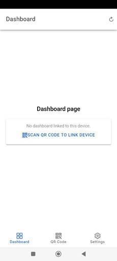

Пустая страница виджетов

#### Привязка мобильного устройства к дашборду

Нажимаем на вкладку снизу “QR Code” и попадаем на страницу сканирования QR-кода, где жмём кнопку “SCAN QR”.

Наводим камеру на QR-код, который получили на сайте, и привязываем телефон к дашборду.

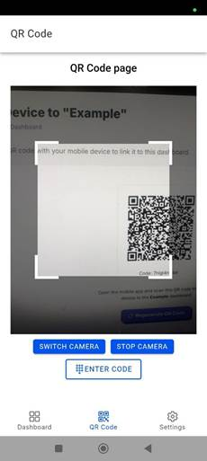

Сканирование QR-кода

После успешной привязки нас перенаправляет на страницу “Dashboard”, где отображаются наши виджеты.


Страница с виджетами

#### Смена главных часов в виджете с часами

Если нажать на циферблат часов, появится модальное окно для установки главных часов, аналогичное веб-версии предпросмотра виджета часов.

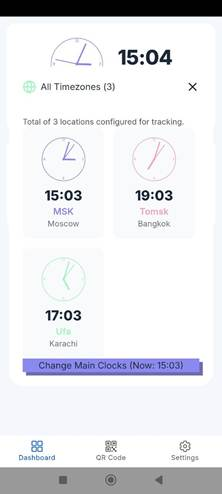

Модальное окно часов

#### Отметка о выполнении в виджете с привычками

Модалка привычек позволяет увеличивать или уменьшать значение счетчика привычки.


Модальное окно привычек

#### Переключение в тёмную тему

Дашборды поддерживают тёмную тему. Её можно включить как на сайте через настройки дашборда, так и в мобильном приложении на странице настроек (кнопка “Settings”).


Страница настроек

После переключения на тёмный режим (“Dark Theme”) нужно нажать “Save settings” — и тема приложения сменится на тёмную.

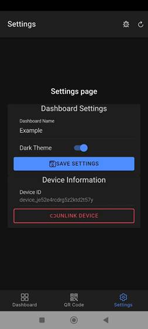

Темная страница настроек

Страница с виджетами также переключилась в тёмный режим, и сами виджеты вместе с модальными окнами отображаются в тёмной теме.

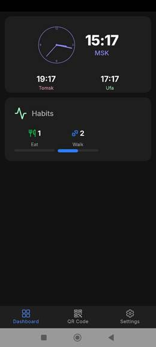

Темная страница с виджетами

#### Отображение в горизонтальном режиме

Если повернуть телефон горизонтально, нижняя панель табов с переключениями страниц приложения скрывается, а также скрываются нативные верхняя и нижняя панели Android.

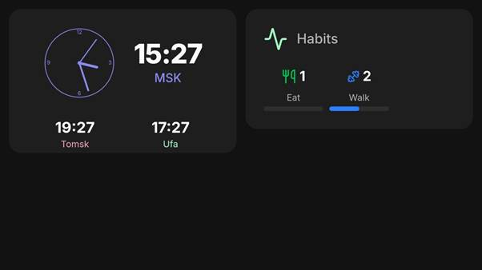

Горизонтальная темная панель с виджетами


Реальная фотография устройства с дашбордом

#### Отвязывание мобильного устройства

Когда устройство привязано к дашборду, ранее привязанное устройство теряет связь с этим дашбордом.

Устройство можно отвязать и прямо из мобильного приложения: на странице настроек нажать кнопку “Unlink device”.


Страница настроек с кнопкой отвязывания устройства от дашборда

---

## Автоматизации

В этом проекте я решил отказаться от готовых монорепозиториев (nx, turborepo) и их экосистемы.

Для удобства CI/CD добавлены многочисленные автоматизации, сгенерированные с помощью нейросети.

Репозиторий содержит несколько проектов: Docker-образ для сборки мобильного приложения, само мобильное приложение и веб-сайт. Есть как общие CI/CD-задачи, так и специализированные под каждый проект.

### Релизы

Сборки и релизы выполняются независимо для каждого проекта и запускаются при наличии изменений в коде.

### TODO-задачи

Создана отдельная задача, которая собирает TODO-комментарии из кода сайта и мобильного приложения и автоматически создаёт issues в GitHub.

### Уведомления

Добавлены уведомления об успешном и неуспешном деплое в Telegram-чат.

---

## Роадмап

Это не полноценный roadmap большого продукта, а список целей, которых я хотел достичь в рамках проекта

Сделано:

1.  Сделать минимальное MVP с несколькими виджетами.
2.  Создать заглушки в интерфейсе под будущие бизнес-задачи.
3.  Написать статью по проделанной работе на Хабр.
4.  Зафиксировать баги, найденные при написании статьи.

Надо сделать:

5.  Описать заглушки в виде задач и постепенно реализовывать их.
6.  Провести полный рефакторинг фронтенда и бэкенда, так как большая часть кода написана с помощью нейросети.

---

## Ссылки

Текущая онлайн версия:
[https://site15-my-dashboard.vercel.app](https://site15-my-dashboard.vercel.app)

Репозиторий проекта:
[https://github.com/site15/my-dashboard](https://github.com/site15/my-dashboard)

Telegram-чат:
[https://t.me/site15_community/187](https://t.me/site15_community/187)

#angular #trpc #analog #ionicframework